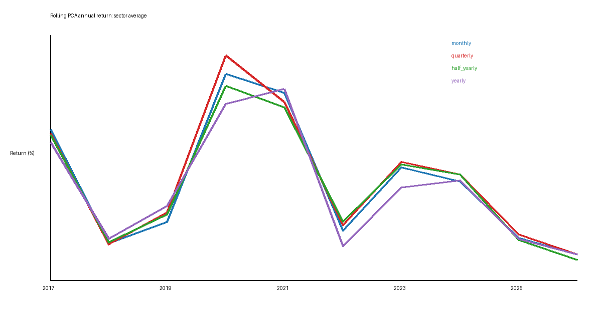
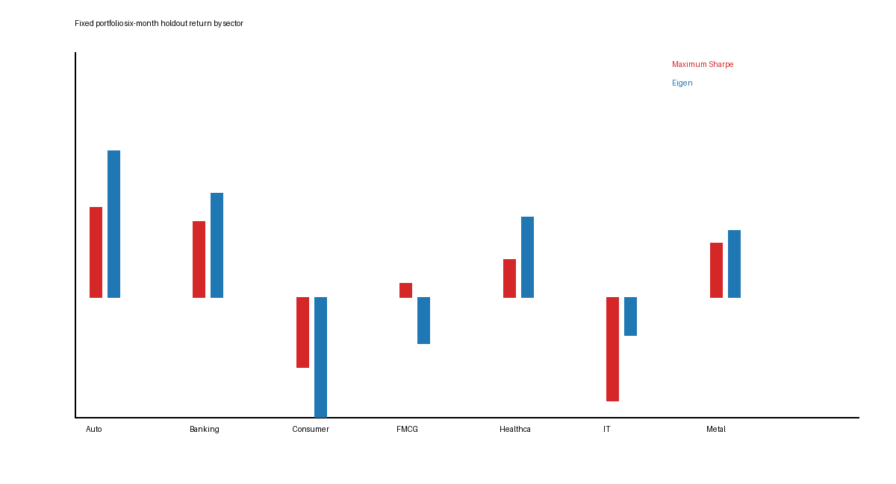

# India Stocks Portfolio Construction 📈

## Abstract

This project investigates long-only portfolio construction for Indian equity sectors. It compares equal allocation, minimum-variance allocation, maximum-Sharpe allocation, and PCA-based eigen portfolios. The data pipeline converts NSE minute bars into daily prices, estimates return and covariance structure, forms constrained portfolio weights, and evaluates fixed and rolling rebalancing designs.

## Results visualizations

The analysis is organized as a research workflow rather than a collection of scripts. Begin with the [EDA and research design notebook](notebooks/00_eda_and_research_design.ipynb), then follow the data, fixed-portfolio, rolling-PCA, and performance notebooks in order.

### Reproducibility map

| Stage | Notebook | Main output |
|---|---|---|
| Research questions and EDA | `00_eda_and_research_design.ipynb` | Data coverage and design checks |
| Data preparation | `01_data_preparation.ipynb` | Daily prices and returns |
| Fixed portfolios | `02_fixed_portfolios.ipynb` | Four portfolio designs and holdout results |
| Rolling PCA | `03_rolling_pca.ipynb` | Monthly, quarterly, half-yearly, and yearly schedules |
| Performance analysis | `04_performance_analysis.ipynb` | Returns, risk, drawdown, and weight tables |

Each notebook explains the purpose of its cells, records the assumptions, and points to the generated tables under `outputs/`.

### Rolling PCA annual returns

The figure compares monthly, quarterly, half-yearly, and yearly rolling PCA rebalancing using the sector-average annual return.

### Fixed six-month sector comparison

This figure compares the fixed maximum-Sharpe and eigen portfolios over the completed six-month holdout experiment.

Short selling is excluded. Every implementable portfolio satisfies:

$$w_i \geq 0, \qquad \sum_{i=1}^{n}w_i=1$$

## 1. Problem statement

An investor must allocate capital across correlated stocks. Equal investment is transparent but ignores volatility and co-movement. A portfolio that selects only high-return stocks can become concentrated and fragile. The objective is to improve the return-risk trade-off while remaining implementable in an Indian cash-equity account.

## 2. Markowitz Modern Portfolio Theory

Let $r_t$ be the vector of stock returns, $\mu=E[r_t]$ the expected-return vector, and $\Sigma=\operatorname{Cov}(r_t)$ the covariance matrix. For weights $w$:

$$R_p=w^T\mu$$

$$\sigma_p^2=w^T\Sigma w$$

The minimum-variance problem is $\min_w w^T\Sigma w$ subject to $w_i\geq0$ and $\sum_iw_i=1$. The efficient frontier contains portfolios offering the highest return for each risk level.

## 3. Four portfolio designs

**Equal weight.** For $n$ stocks, $w_i=1/n$.

**Minimum risk.** Select weights minimizing $w^T\Sigma w$ under long-only constraints.

**Optimum risk.** Select weights maximizing:

$$\max_w\frac{w^T\mu-r_f}{\sqrt{w^T\Sigma w}}$$

using an annual risk-free rate of $r_f=1\%$.

**PCA eigen portfolio.** PCA decomposes the standardized return covariance structure:

$$\Sigma_zv_k=\lambda_kv_k$$

Absolute component loadings become long-only candidates:

$$w_{k,i}=\frac{|v_{k,i}|}{\sum_j|v_{k,j}|}$$

The component portfolio with the strongest Sharpe ratio is selected. PCA therefore supplies factor-based candidates, while the MPT risk-return objective selects the final portfolio.

## 4. Data and preprocessing

Minute OHLCV files are converted to final session closes, timestamps are converted to Indian trading dates, daily simple returns are calculated, and annualized returns, volatility, covariance, and correlations are estimated using 250 trading days.

## 5. Fixed and rolling designs

The paper estimates portfolios over 2016–2020 and evaluates them from January to July 2021. The completed local fixed experiment uses July 2020–June 2025 for construction and July–December 2025 for testing.

The rolling PCA experiment uses the previous one year of data to form the next portfolio. Weights are recalculated monthly, quarterly, half-yearly, or yearly. For example, 2016 data forms 2017 weights and 2017 data forms 2018 weights. Only information available before each rebalance is used.

## 6. Performance metrics

For daily values $V_t$, cumulative return is $V_T/V_0-1$. Annualized volatility is $\operatorname{std}(r_p)\sqrt{250}$. Sharpe is $(R_p-r_f)/\sigma_p$. Sortino replaces total volatility with downside deviation. Drawdown is:

$$DD_t=\frac{V_t}{\max_{s\leq t}V_s}-1$$

and Calmar is $\operatorname{CAGR}/|\operatorname{MDD}|$.

## 7. Deployment constraints

The framework supports no shorting, no leverage, normalized weights, maximum position sizes, integer-share allocation, residual cash, turnover limits, transaction costs, and slippage. A production version should use adjusted prices, corporate-action handling, liquidity filters, and broker-side controls.

## 8. Outputs and limitations

`report.pdf` contains the research-style method report. `src/portfolio_methods.py` contains long-only normalization and statistics. Rolling PCA results are in `output/rolling_pca_yearly_returns.csv` and `output/rolling_pca_full_report.md`.

The four-method rolling benchmark metrics require retained daily equity curves and have not been fabricated. Historical results are not guarantees and remain subject to survivorship bias, corporate actions, market impact, transaction costs, parameter sensitivity, and partial 2026 data.

## License

MIT
